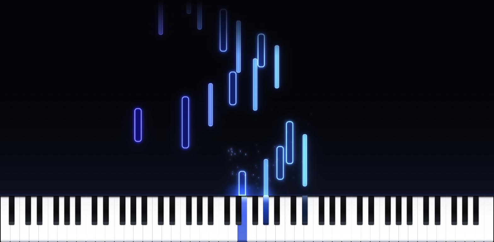

# MIDI Piano Visualizer

Визуализатор игры на MIDI-клавиатуре: ноты растут вверх от клавиш, клавиатура
светится, сцена собирается из независимых слоёв.



Демо: <https://wendor.github.io/piano_visualizer/>

## Запуск

```bash
npm install
npm run dev        # http://127.0.0.1:5180
npm run build      # проверка типов + сборка в dist/
npm run typecheck
npm run lint       # eslint + проверка форматирования
npm run format     # prettier по месту
npm test           # vitest
npm run bench      # стенд слабой машины, см. «Замер»
```

Web MIDI работает только на `localhost` или по HTTPS.

## Управление

| Клавиши | Действие |
|---|---|
| `Z` `X` `C` `V` … и `Q` `W` `E` `R` … | играть с клавиатуры ПК (два ряда, как в трекере) |
| `Пробел` | педаль |
| `` ` `` | открыть и закрыть настройки |
| `Enter` | пуск и пауза файла |
| `←` `→` | перемотка на 5 секунд, с `Shift` — на 30 |
| `Home` | в начало файла |

Настройки — единственная горячая клавиша в игровом режиме: пока панель закрыта,
клавиатура целиком принадлежит нотам. Внутри панели: `↑` `↓` — пункт,
`←` `→` — значение, `Enter` — переключить или выполнить, `Esc` — закрыть.
Значения сохраняются в `localStorage` и переживают перезагрузку; «Сбросить всё»
возвращает исходные, «Сохранять настройки» выключает запись.

Мышью и пальцем можно играть прямо по нарисованным клавишам. Пока не сыграна
первая живая нота, работает автодемо.

## Файлы MIDI

Перетащите `.mid` на окно — или нажмите «выберите файл» в подсказке. Файл сразу
начинает играть: ноты падают сверху и входят в клавиши, как в Synthesia, а живая
игра по-прежнему рисуется растущими вверх нотами. Направление можно закрепить
вручную пунктом «Направление нот» в настройках.

Полоса над клавиатурой появляется вместе с файлом и прячется, когда мышь
замирает: имя, прогресс с перемоткой мышью, время, скорость, повтор и дорожки.
Скорость и дорожки — одинаковые выпадающие списки с галочками: ×0.25…×2 в одном
и имена партий во втором.

**Дорожки.** То, что человек называет дорожкой, в файле бывает и дорожкой, и
каналом: в формате 0 всё лежит в одной дорожке, а партии различаются каналами.
Партия — это пара «дорожка + канал», такое деление покрывает оба случая. Имя
берётся из мета-события с именем дорожки, а если его нет (а его часто нет) —
из инструмента General MIDI по program change: «Рояль», «Пальцевый бас»,
«Струнный ансамбль 1», десятый канал всегда «Ударные». Выключенная партия не
звучит и не рисуется; `Alt` + клик оставляет только её.

**Сетка тактов.** Под падающими нотами лежат линии тактов и долей: сильная доля
заметна, остальные едва видны. Размер такта берётся из файла (`3/4`, `6/8` —
в шести восьмых доля восьмая), карта темпа двигает линии вместе с музыкой, а
смена размера посреди пьесы начинает новый такт прямо на себе. Яркость обеих
сеток — два пункта в настройках, ноль выключает. При живой игре сетки нет:
темпа взять неоткуда.

Поддержаны форматы 0 и 1, running status, карта темпа, размер такта, педаль
(CC64) и имена дорожек в UTF-8 или cp1251. Тики переводятся в секунды при разборе, поэтому
дальше по проекту время везде в секундах. Файлы с делением SMPTE отклоняются
с сообщением в подсказке.

## Звук

Ноты слышно: и живую игру, и файл. Звук берётся не из синтеза, а из живых
сэмплов — звуковых таблиц [WebAudioFont][waf] (банк FluidR3 GM). На клавишу
натягивается ближайший по диапазону сэмпл и подстраивается скоростью
воспроизведения; рояль не зацикливается и затухает сам, как настоящий, а орган
и струнные тянутся по петле, пока держат клавишу.

Плеер здесь свой, компактный: из проекта WebAudioFont взяты только **данные**.
Их формат — объектный литерал JavaScript со звуком в base64; файл не
выполняется, а превращается в JSON и разбирается — чужой код, пришедший по
сети, исполнять незачем.

Браузер включает звук только после первого действия человека, поэтому таблица
инструмента загружается по первому нажатию, а не при открытии страницы.
Педаль движок не разбирает: сцена сама держит ноту, пока педаль нажата, и
присылает отпускание только когда оно действительно случилось.

**Атака не дрожит.** Ноты файла рождаются в кадровом цикле, поэтому их начало
приходится на границу кадра: две тридцать вторые вместо ровных 62 мс расходятся
то на 50, то на 83. Плеер сообщает звуку возраст ноты внутри кадра, а сэмплер
возвращает её на столько же назад — все ноты получают одно и то же смещение,
дрожь исчезает. Взамен остаются постоянные 50 мс задержки, которые слух не
замечает. Живая игра идёт мимо: исполнителю упреждение ни к чему.

Тембр «как в файле» поднимает для каждой партии её инструмент General MIDI —
рояль, бас, саксофон, орган звучат каждый собой. Это несколько мегабайт
загрузки, поэтому по умолчанию выбран один рояль. Ударные пока не звучат: в
этих таблицах у каждого удара свой сэмпл, и на них нужен отдельный подход.

```bash
npm run sound:fetch            # положить рояль в public/sound/
npm run sound:fetch -- 0 4 48  # рояль, электропиано, струнные
```

Скачанные таблицы визуализатор берёт с диска и играет без интернета; если
местной копии нет, он загрузит её из сети.

[waf]: https://surikov.github.io/webaudiofont/

## Производительность

Сцена знает свою цену. Ступень качества — «авто», «высокое», «среднее»,
«низкое» — двигает разом разрешение холста, потолок его площади, размер буфера
свечения, глубину пирамиды размытия, плотность частиц и мелкие украшения вроде блика
по канту ноты. На средней ступени холст рисуется в 0.8 разрешения экрана, на
низкой — в 0.4 и растягивается при выводе: на глаз почти незаметно, работы
вшестеро меньше.

Плотность экрана о нагрузке говорит мало, поэтому площадь холста ограничена
прямо: телевизор на 4K отдаёт `devicePixelRatio` равный единице и тем самым
просит 8.3 мегапикселя — вчетверо больше ноутбука с Retina, при несопоставимо
более слабом ускорителе. Потолок ступени (6.2, 3.0 и 0.9 мегапикселя) режет
плотность, а CSS-размер остаётся прежним.

«Авто» считает время длиной кадра, а не шагом сцены: шаг ограничен потолком в
50 мс, чтобы прыжок времени не рвал физику, — и на машине, где кадр идёт 180 мс,
«полторы секунды подряд тяжело» растянулись бы на восемь реальных секунд.
Ступень опускалась бы медленнее всего там, где она нужнее всего.

«Авто» смотрит на **время работы кадра**, а не на промежуток между кадрами:
при вертикальной синхронизации промежуток всегда равен периоду экрана и о
запасе ничего не сказал бы. Второй признак — **рваный ход**: доля кадров,
выбившихся из обычного промежутка. Среднее о ней молчит — телефон при касании
поднимает экран до 120 Гц, кадров становится больше, а идут они рвано, и
картинка дёргается при формально прекрасном счёте. Полторы секунды подряд
тяжело — ступень опускается, шесть секунд с запасом — возвращается, а первые
две секунды после смены не судят вовсе: холст и кэши ещё перестраиваются.

Счётчик кадров в настройках показывает к/с, время кадра и текущую ступень, а
когда есть о чём — число рывков с худшим кадром и блокировки главного потока:
разовое замирание рывками не описать, через секунду ход снова ровный. О самих
блокировках браузер сообщает сам (Safari молчит, и счётчик от этого не
ломается).

Что было сделано ради скорости:

- блум размывает буфер свечения **внутри буфера**, а не на экране: сторона
  вчетверо меньше — работы в шестнадцать раз меньше, и на сцену ложится один
  готовый рисунок вместо трёх полноэкранных размытий;
- **дорогу размытия выбирает замер, а не вкус.** Размыть буфер можно пирамидой
  уменьшений — вдвое меньше вчетверо дешевле, и каждая ступень добавляет свой
  масштаб света — или фильтром `blur(...)`. В Chrome без ускорения холста
  пирамида вдвое дешевле фильтра (7.3 мс против 17.0), а Firefox, наоборот,
  размывает фильтром почти даром, но `drawImage` с уменьшением между холстами
  роняет на программный путь — там пирамида стоит 50 мс вместо сотой доли.
  Поэтому сцена проезжает обе дороги отрезками по дюжине кадров и остаётся на
  дешёвой. Отрезками, а не через кадр: движку нужно несколько обновлений, чтобы
  выйти на установившийся ход, и чередование меряет не дороги, а перекладку
  поверхностей между ними;
- буфер свечения наполняется **сорок раз в секунду**, а не каждый кадр: свет
  размыт и инерционен, между 40 и 60 обновлениями глаз разницы не видит, а из
  среднего кадра уходит половина работы всех светящихся слоёв. Мера — секунды,
  не кадры: на машине, где их и так шесть в секунду, «через кадр» превратилось
  бы в моргание, поэтому там работа идёт каждый кадр;
- ноты светятся прямоугольником без скруглений: в буфере свечения нота вчетверо
  уже, скругление там — пара пикселей, и размытие съедает его раньше, чем глаз
  заметит; путь на каждую ноту в каждом кадре строить незачем;
- буфер свечения не наполняется, **пока о нём никто не просит**: выключенный
  блум или сила на нуле — это не «сцена без свечения», это сцена, которой
  незачем его считать. На замере 74 к/с против 85;
- полосы нот живут между кадрами: рождать объект на каждую ноту значит отдавать
  сборщику мусора тысячи штук в секунду, а платит он за это рывками;
- искры рисуются группами: яркость и толщина огрублены до шести ступеней,
  поэтому одна обводка приходится на десяток искр, а не на каждую (1.1 → 0.7 мс).
  Порядок в списке не виден — искры складываются по яркости, — и его отдали
  под группировку;
- ноты, клавиши и ореолы рисуются от своего угла, поэтому градиент зависит
  только от цвета и размера и берётся из кэша: раньше на каждую видимую ноту
  в каждом кадре рождался новый `createLinearGradient`;
- дымка и шлейфы живут только в буфере свечения — там они стоят вчетверо
  дешевле и сразу получаются мягкими;
- отражения зала затухают умножением, а не возведением в дробную степень на
  каждом из трёхсот тысяч отсчётов: 4.5 мс вместо 14.8 на замедленной машине.
  Работа разовая, но приходилась ровно на первое касание.

### Замер

У телевизора нет клавиатуры: `` ` `` для панели настроек с пульта не нажать, а
адрес ввести можно. Поэтому всё нужное для замера включается из строки запроса:

| Запрос | Что делает |
|---|---|
| `?profile=1` | счётчик кадров и разбор кадра по слоям поверх сцены |
| `?quality=low` | ступень вместо автоматической: `auto`, `high`, `medium`, `low` |
| `?off=effects.bloom,effects.dust` | не включать эти слои |
| `?set=sound/reverb=0,effects.bloom/strength=0.4` | подменить настройки по идентификатору `владелец/ключ` |

Флаги из адреса не сохраняются: ими смотрят на конкретный случай, а не меняют
записанное в `localStorage`. Опечатка в имени слоя или настройки не проходит
молча — о ней говорит подсказка, иначе выключенным сочтут то, что всё это время
работало, и замер соврёт.

Стенд повторяет слабую машину на своей: Chrome без аппаратного ускорения и с
замедленным процессором, кэш выключен (иначе первый сценарий грузит звук по
сети, а следующие берут его из кэша), звук разбужен настоящим щелчком мыши.
`--soft-canvas` берёт середину между крайностями — холст растеризует процессор,
а слои на экране складывает всё-таки видеочип: так живёт обычный телевизор, и
на нём видно, что можно отдать композитору, а что нет.

```bash
npm run dev
npm run bench -- --cpu 6 "quality=low" "quality=low&off=effects.bloom"
```

Каждый довод — свой запуск: к/с, время кадра, худший кадр, число рывков, долгие
задачи и разбор кадра по слоям, а в конце — сравнение по кадрам в секунду.
`--gpu` возвращает ускорение, `--soft-canvas` оставляет его только композитору,
`--seconds` меняет длину замера, `--shot кадр-%.png`
снимает сцену, `--firefox` меряет другим движком (`--pref имя=значение` кладёт
настройки движка в свежий профиль), а запись вида `"запрос | код"` выполняет код
на уже готовой сцене — так выключается отдельная фаза слоя, не заводя ради
опыта настройку в самом приложении.

## Архитектура

```
src/
├── core/          сцена, геометрия, цикл кадров, ступень качества, замер, реестр
├── theme/         палитры и цветовая модель
├── audio/         звуковые таблицы и сэмплерный движок
├── layers/        визуализации и эффекты
├── score/         партитура: разбор .mid, транспорт, воспроизведение
├── input/         источники нот
├── settings/      реестр параметров и их сохранение
└── ui/            подсказка, панель настроек, полоса файла, горячие клавиши
```

Ключевая идея: **сцена ничего не рисует**. `Scene` хранит только музыкальное
состояние — нажатые клавиши, историю нот, педаль, геометрию клавиатуры и тему.
Всё изображение собирают слои, а ноты приходят от источников ввода. И то и
другое подключается и отключается на ходу.

### Слои

Слой объявляет ступень отрисовки и переопределяет нужные шаги:

```ts
import { BaseLayer, Stage } from "./core/types";
import type { Scene } from "./core/Scene";

export class RippleLayer extends BaseLayer {
    readonly id = "effects.ripple";
    readonly stage = Stage.Particles;

    override update(scene: Scene, dt: number): void { /* физика */ }
    override drawGlow(g: CanvasRenderingContext2D, scene: Scene): void { /* в буфер свечения */ }
    override draw(g: CanvasRenderingContext2D, scene: Scene): void { /* в основной холст */ }
}
```

Ступени задают порядок и не требуют правок в других файлах:

| Ступень | Что там рисуется |
|---|---|
| `Background` | фон сцены |
| `NotesBack` / `Notes` | сетка тактов, затем визуализация нот |
| `Particles` | искры, свет клавиш |
| `Bloom` | накопленный буфер свечения ложится на сцену |
| `Atmosphere` | затемнение у кромки, линия удара |
| `Keyboard` | рояль и подсветка нажатых клавиш |
| `Overlay` | всё, что поверх |

Слои изолированы друг от друга: каждому холст достаётся с чистым состоянием,
а слой, бросивший исключение, выключается и сообщает о себе в подсказке — одна
ошибка в эффекте не уносит всю сцену.

Всё, что должно светиться, слой рисует в `drawGlow` — общий буфер низкого
разрешения. `BloomLayer` размывает его несколькими масштабами и кладёт на сцену
одним рисунком: свечение управляется одним числом, не выжигает картинку в белое
и стоит дёшево независимо от размера окна. Масштабы складываются один в другой,
поэтому вклад широкого света виден как произведение весов над ним; в настройках
это по-прежнему один ползунок силы. Чем именно размывать — пирамидой уменьшений
или фильтром — слой решает сам, проехав обе дороги на живых кадрах.

Фон живёт там же: дымка — несколько мягких облаков, которые плывут, собираются
там, где сейчас играют, и разгораются от игры; пыль медленно всплывает от
клавиш и мерцает; за нотой тянется шлейф, а внутри ноты плывёт живая заливка — у каждой ноты
своя: она берёт из общего облачного тайла своё место и плывёт со своей
скоростью, поэтому на аккорде и на повторяющейся ноте не видно одного и того
же узора.
Все они дышат по энергии момента — величине сцены, которая растёт от ударов,
держится, пока клавиши зажаты, и гаснет в тишине.

Клавиатура рисуется двумя кэшированными слоями — белые клавиши, затем чёрные.
Подсветка нажатой белой клавиши ложится между ними, поэтому цвет физически не
может попасть на соседние клавиши.

### Ноты: прошлое и будущее

Живая игра знает только прошлое: нота рождается в момент нажатия. У файла есть
расписание, поэтому ноты можно показать до того, как они прозвучат. Это два
разных слоя — `notes.rising` и `notes.falling` — и переключение между ними
сводится к включению нужного (`NotesDirector`). Форму, цвет и скорость оба
берут из общего `NoteStyle`, поэтому ноты выглядят одинаково в обоих режимах.

Падающий слой каждый кадр разбирает только видимое окно партитуры: двоичный
поиск по началу ноты плюс проход назад на длину самой длинной ноты. Файл на
тысячи нот стоит столько же, сколько короткий.

Сетка тактов (`notes.grid`) едет с ними в обнимку: координата считается тем же
выражением и из того же `NoteStyle`, поэтому линии и ноты не могут разъехаться.
Разбор превращает карты темпа и размера в два списка секунд (`Score.grid`) —
дальше сетка живёт в секундах, как и всё остальное время в проекте. Рисуется
она только в основной холст: разметка — не свет, в буфере свечения она
размазалась бы в туман.

`Playback` держит партитуру и транспорт, а ноты отдаёт в сцену обычными
`noteOn`/`noteOff` — поэтому подсветка клавиш, искры и свет работают
одинаково и для файла, и для живой игры. Время идёт из `Scene.advance`, так что
картинка и звучащие ноты не расходятся.

### Подключение

```ts
visualizer.addLayer(new RippleLayer());        // напрямую
visualizer.removeLayer("effects.sparks");
visualizer.toggleLayer("effects.bloom", false);

layerRegistry.register("effects.ripple", () => new RippleLayer());
visualizer.createLayer("effects.ripple");      // через реестр, по имени
```

Набор по умолчанию — `DEFAULT_STACK` в `src/layers/index.ts`.

### Настройки

Панель ничего не знает о слоях: она рендерит то, что лежит в `SettingsStore`,
а параметры объявляет их владелец. Слою достаточно вернуть описания из
`params()` — пункты появятся в панели и начнут сохраняться сами:

```ts
export class RippleLayer extends BaseLayer {
    readonly id = "effects.ripple";
    readonly stage = Stage.Particles;
    readonly title = "Круги";            // подпись переключателя слоя
    readonly options = { speed: 120 };

    override params(): ParamSpec[] {
        return [
            {
                type: "number",
                key: "speed",
                label: "Скорость кругов",
                group: "effects",
                min: 40,
                max: 400,
                step: 10,
                format: (value) => `${Math.round(value)} px/с`,
                get: () => this.options.speed,
                set: (value) => { this.options.speed = value; }
            }
        ];
    }
}
```

Типы параметров: `number` (диапазон, шаг, формат), `enum` (список вариантов),
`boolean` (свои подписи вместо «вкл/выкл»), `action` (кнопка). Переключатель
«включён» стор добавляет слою сам, если у того не выставлено
`toggleable = false`. Группы панели идут в постоянном порядке: вид, ноты,
эффекты, звук, ввод, система. Настройки, не принадлежащие слоям — палитра,
диапазон клавиатуры, система — объявлены в `src/settings/globalParams.ts`,
а качество и звук приносят свои `params()` в `src/main.ts`; всё через один и
тот же `store.addOwner`.

Состояние целиком снимается в `store.snapshot()` и восстанавливается
`store.restore()`; `SettingsPersistence` держит его в `localStorage` с версией
схемы. Всё непонятное при чтении молча пропускается: чужая версия, неизвестный
ключ, не тот тип, битый JSON, недоступное хранилище. Числа зажимаются в
объявленный диапазон.

### Источники нот

```ts
export class MyInput implements InputSource {
    readonly id = "input.my";
    attach(scene: Scene): void { /* scene.noteOn(60, 100, { performance: true }) */ }
    detach(): void {}
}
```

Встроенные: `input.midi` (velocity, педаль CC64, горячее подключение),
`input.computerKeyboard`, `input.pointer`, `input.demo`.

### Геометрия клавиатуры

`KeyboardLayout` считает раскладку настоящего рояля: все белые клавиши одной
ширины, выровненной по целому числу физических пикселей; чёрные расставлены по
модели инструмента — внутри групп «до-ре-ми» и «фа-соль-ля-си» задние части
белых клавиш равны, поэтому крайние диезы смещены наружу от стыков, а соль-диез
стоит ровно по стыку. На узком экране диапазон автоматически сужается
(88 → 76 → 61 → 49 клавиш), а ноты вне диапазона переносятся октавами внутрь.

## Легаси

`legacy/` — исходный набросок на одном HTML-файле, с которого начинался проект.
